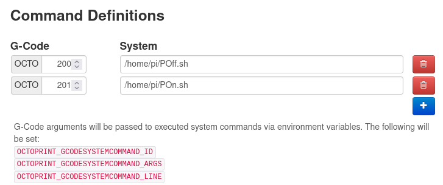

# GCode System Commands #

Literally, an "OCTO" followed by a number. This sets up a call to the operating system to perform a task. 
The main requirement is that the task is quick. You don't want the whole system hanging for seconds while your 
little database program decides to reindex your tables... 
### The Overview ###
I decided to start my numbering scheme at 100. For me, it's a subconscious trick to leave plenty of room for 
adding things I didn't know I needed when I start out. I took the numbering up at OCTO##0 as Off and OCTO##1 as On. 
 
When the system call is made, the following items are included as environment variables: 
<table><tr><th>Variable</th><th>Value</th></tr>
<tr><td>OCTOPRINT_GCODESYSTEMCOMMAND_ID</td><td>Just the number 200 etc.</td></tr>
<tr><td>OCTOPRINT_GCODESYSTEMCOMMAND_ARGS</td><td>Everything following the number</td></tr>
<tr><td>OCTOPRINT_GCODESYSTEMCOMMAND_LINE</td><td>The whole line</td></tr>
</table>
I could have used these many different ways. I could have used one script, say for Power as above, and keyed whether 
On or Off by using the __ID number itself. That would save me space on the file system but might make it take longer to run 
(though probably not by much).  
If you run on Windows, I have no idea how fast the shell takes to load to process a script but it is important.  
<b>We are going to blow by my tool change scripts because I think they are too specialized and in turmoil at this time.</b>  
So we are at 'OCTO190/191' that uses Raspberry Pi GPIO library to turn a pin off and on. This pin is connected to a MOSFET 
driver. Example:[https://www.amazon.com/High-Power-Trigger-Adjustment-Electronic-Brightness/dp/B0893MKNB2] to run a 
slim-line 12V case fan under my heated bed. The scripts are BCFStart/Stop.  
Next up is the Power set 'OCTO200/203'. These are simple 'wget' calls to my Tasmota wireless switches for Printer and Lights. 
Quick, quiet, efficient and relatively inexpensive. Example:[https://www.athom.tech/blank-1/tasmota-us-plug-v2]  
Let's jump to the end with 'OCTO600/601', the Time series. These are just little utility scripts to record the time of some events 
from the Gcode file. <b>Wow</b> that's embarrassing - no - I - I was just testing you... OCTO600 writes the Start time (EPOC seconds) 
and OCTO601 writes the Stop time (subtract the start from the stop to find the number of seconds used). 
Example: "/home/pi/.octoprint/BLV.dat 
<code>
Start: 1695989508
Stop: 1695992889
</code> 
This is called from my @Do_Bed macro and yes - it does take 56 minutes and 21 seconds to run a triple tap 10 by 10 mesh on 
an ANET A8! The file name to write is <b>part</b> of the commamd. So I used "OCTO600 BLV.dat" at the beginning and 
"OCTO601 BLV.dat" at the end. So you could "OCTO600 PTime" at the start and then time each tool change using "OCTO600 TTime" 
to "OCTO601 TTime" to figure straight tool changes to end up with two files, one for the full print time and the other of tool 
change times... Or you could change the script to include the tool number and write it all to one file... hmmm. 

### Important ###
 
For your scripts to run on a Pi (or any other Linux based system, they have to be marked as 'executable'.
Use 'chmod 755 file' to make the file executable.
> Note:  
This image is from one of my workstations that has my makerpi.local OctoPrint mounted via Samba/CIFS so I can play from one location. 
That is why the owner and group are brett and not pi as it would be <b>on</b> the pi. 
### The Workhorse Set ###
So now we get to the workhorses of the GCode Macros and GCode System Commands "OCTO400/402". 
The format of these data files are for the include statements in <b>jinja2</b> as used in the <b>GCode Macros</b>
<ul>
  <li>
    <b>OCTO400</b> Variable.sh 
    As described in the toplevel README, this command is used to edit my data file in the "/home/pi/.octoprint/data/gcode_macros/" 
    directory. It can edit any data file in that directory that uses the form of ""
  </li>
  <li>
    <b>OCTO401</b> LevelClear.sh 
    This command replaces the "/home/pi/.octoprint/data/gcode_macros/Level.data" with a first level check. 
    This format "[ (0,\"First Layer Check\") ]" is an array in <b>jinja2</b>.
  </li>
  <li>
    <b>OCTO402</b> LevelAdd.sh 
    This command tacks on more layer operations onto the end of the Layer.data file to expand the array.
  </li>
</ul>
All of these are inserted into my Gcode file from a post processor script of my slicer. 

> Note:  
The file <b>OctoStatus.sh</b> is used with the <b>OctoPrint</b> config.yaml Events call back.
