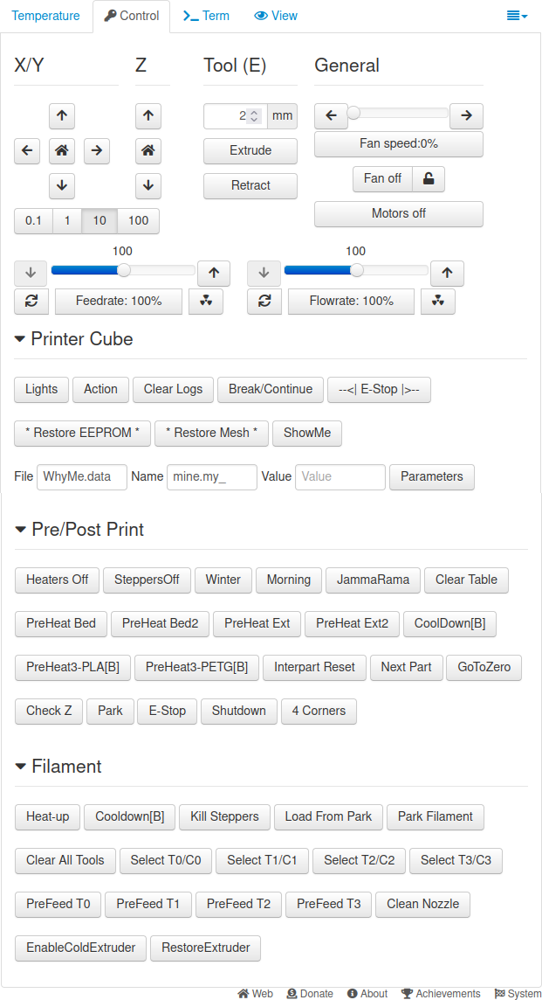
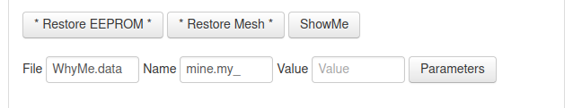
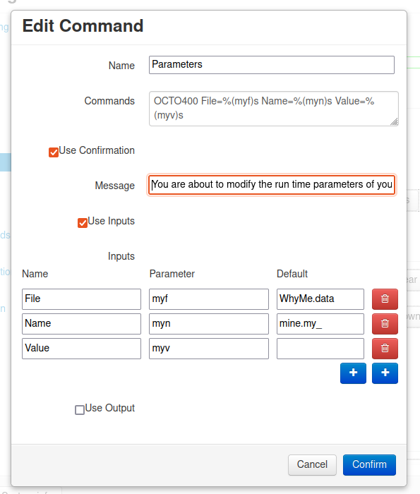
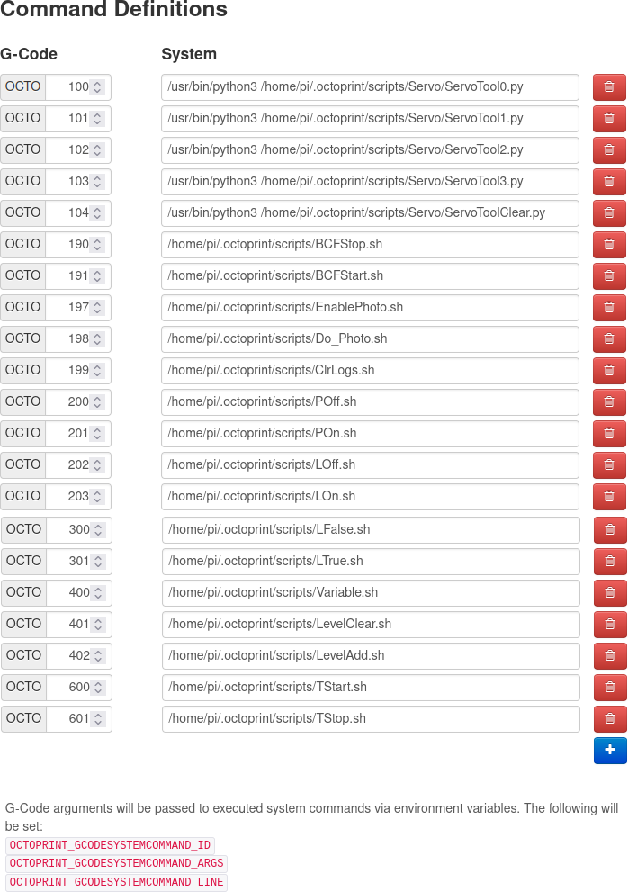

# OctoPrint-Parametric-Macros #
Setting up and using parametric macros using OctoPrint and various plugins.
  Along with other hints and tricks.

## Select and install the plugins ##
Run, don't walk, to https://plugins.octoprint.org/
and get:<br>
<li>
  GCode Macros https://github.com/cp2004/OctoPrint-GcodeMacros<br>
  OctoPrint Gcode Macros Plugin
    Create custom commands you can add anywhere: in your gcode file, OctoPrint’s terminal, gcode scripts, or other plugins to run a configured script.<br>
    Use macros for preheating your printer, levelling the bed, changing filament… Possibilities are (nearly) endless!<br><br>
</li>
<li>
  GCode Systems Commands https://github.com/kantlivelong/OctoPrint-GCodeSystemCommands<br>
    This OctoPrint plugin adds the ability to define GCode commands that execute local system commands.<br><br>
    </li><br>

## You can also use this plugin(maybe) ##
<li>
  Custom Control Editor https://plugins.octoprint.org/plugins/customControl/<br>
    Makes custom controls editable via the settings dialog.<br>
    This plugin helps you create, edit and delete your custom controls. You can easily access all the options in the settings under “Custom Control Editor”.<br>
</li><br>

# The Magic #
Ok, first, I walked away from using Microsoft products in 2004 or so and have never looked back (except to laugh!)<br>
If you want to do this on Windows (without loading up some Linux compatability programs) you are on your own...<br>
That being said - Welcome!<br>
### Note 1: ###
To save yourself some heartache, place ALL your bash shell scripts in "/home/$USER/.octoprint/scripts/"
### Why: ###
The directory is backed up and restored with OctoPrint Backup command! I even put my boot and crontab files there.<br><br>

## This is only a quick review with no real instructions

<b>Here is my Controls Page using Custom Control Editor</b>



<b>That's a lot of stuff! Need it? No. But it is what led me down this rabbit hole...<br>And this is the little trick it taught me!</b>



<b>This is configured in Custom Control Editor plugin.</b>



<b>This was derived from GCode Systems Commands plugin.<br>(See the stuff in red at the bottom?)</b>



<b>So it calls "Variable.sh"</b>
```
#!/bin/bash
# this is to give OP something to call
# full paths required
# $OCTOPRINT_GCODESYSTEMCOMMAND_ARGS=
# "File=WhyMe.data Name=my_flag Value=true"

# my_string="File=WhyMe.data Name=mine.my_State Value=false"
my_string="$OCTOPRINT_GCODESYSTEMCOMMAND_ARGS"

# Strip each part of the string
# break at 'space'
my_file=${my_string%%' '*}
# delete the part captured
my_newstring=${my_string/$my_file/}
# break that at '='
my_file=${my_file##*'='}
# delete the leading space
my_newstring=${my_newstring/# /}
# rinse and repeat for all
my_name=${my_newstring%%' '*}
my_newstring=${my_newstring/$my_name/}
my_name=${my_name##*'='}
my_newstring=${my_newstring/# /}
#my_value=${my_newstring%%' '*}
my_value=${my_newstring##*'='}

# sed -i 's/true/false/' /home/pi/.octoprint/data/gcode_macro/my_Logic.flag
# 

orig="{%- set $my_name = "
rep=""

cmd="/usr/bin/sed -i 's/$orig.*/$rep/' /home/pi/.octoprint/data/gcode_macro/$my_file"
# echo "File is: $my_file"
# echo "Name is: $my_name"
# echo "Value is: $my_value"

## /usr/bin/echo "$my_string" >> /home/pi/ShowMe
## /usr/bin/echo "$cmd" >> /home/pi/ShowMe
eval $cmd

exit
```
<b>Specifically, this lets me edit my runtime variables file from the Control Tab.<br>It also lets me edit them from the Gcode file!<br>For example:</b>
```
;TYPE:Custom
; custom gcode: start_gcode

; Inserted from post processor script in SuperSlicer that converts a text file of
; layer based actions manually entered from the slicers preview screen.

OCTO400 File=WhyMe.data Name=mine.my_LayerCount Value=0
OCTO400 File=WhyMe.data Name=mine.my_LayerMatch Value=0
OCTO400 File=WhyMe.data Name=mine.my_Layer Value=0
OCTO400 File=WhyMe.data Name=mine.my_State Value=false
OCTO401
OCTO402 Name=64 Value="Place O-Ring"

; The only action is to place an O-Ring at the start of layer 65 (see notes)
; I always stop after Layer 1 cause I ain't gonna print with a shitty first layer.

M117 ARC_WELD ; post processing flag if printer can do G02/G03
; leave above as some post processors can remove comments

; This trips my ArcWelder script post processor

G21 ; my set units to millimeters
G90 ; my use absolute coordinates
M82 ; my use absolute distances for extrusion
[...]
; custom gcode: start_filament_gcode
;Filament gcode
; extruder Black PLA
; custom gcode end: start_filament_gcode
;_TOOLCHANGE 0
;LAYER_CHANGE
;Z:0.2
;HEIGHT:0.2
; custom gcode: before_layer_gcode
; Before layer change
OCTO100
G4 P500
; This is my Tool change Servo based, I give it 1/2 second to complete
G1 F200 E25
M400
G92 E0
OCTO400 File=WhyMe.data Name=mine.my_LayerFR Value=200
; Another post processor script looks for every @DoLayer line and saves the current Feedrate
; in case I mess with it.
@DoLayer
; @DoLayer does everything. If I want timelapse or an action at a layer. All set with flags
; in the WhyMe.data file.
; custom gcode end: before_layer_gcode
[...]
;TYPE:Skirt
```

## That was a little taste ##

Each subdirextory contains my code and explains how it is used and how it is related to the other parts of my "system" (I am so funny).
Enjoy!

[](https://ko-fi.com/cmdrcody) or [](https://github.com/CmdrCody51/OctoPrint-Parametric-Macros) Use GitHub!

<small>You can also send funds via PayPal to cmdrcody&#64;pharowt&#46;com</small>

